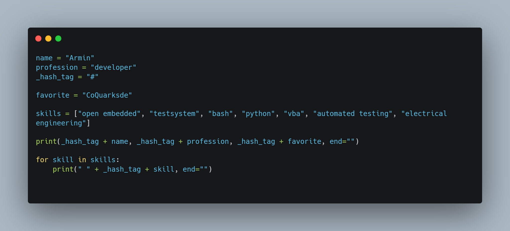

- 👋 Hi, I’m @CoQuarksde
- 👀 I’m interested in #Coding #Electrical Engineering #Python #VBA #C #Open Embeddded #Automated Testing #Docs
- 🌱 I’m currently learning #C++, #Databases, #DataScience, #BigData&AI, #tbot and #PyTest
- 💞️ I’m looking to collaborate on #BSP #Barebox #U-Boot #Python #GUI-Dev #MachineLearning, #FrontEnd
- 📫 How to reach me etedali.armin@gmx.de

 

<!---
CoQuarksde/CoQuarksde is a ✨ special ✨ repository because its `README.md` (this file) appears on your GitHub profile.
You can click the Preview link to take a look at your changes.
--->
